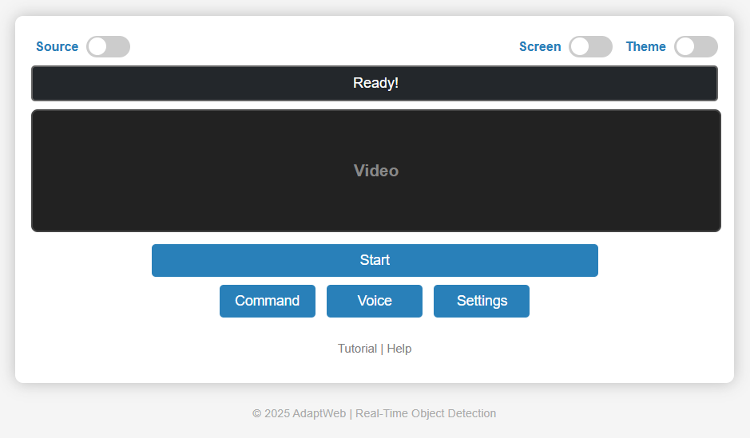

# OpenLens: Web-Based Real-Time Object Detection


**OpenLens** is a web-based application for real-time object detection and video analysis. It supports live camera input, video files, and IP streams (IP cameras and mobile devices) with customizable detection settings and an intuitive user interface.

<br/>
<p align="center">
&emsp;
</p>

## Features

- **Real-Time Detection**: Detects objects in live video streams.
- **Modular Backend**: Node.js backend for stream management and API integration.
- **Customizable Detection**: Configure detection for fire, motion, and more.
- **Intuitive UI**: Includes help, tutorial, and menu components.
- **Flexible Input**: Supports webcam, video files, IP cameras, and internet streams.
- **Source & Unit Selection**: Easily switch between video sources.

## Requirements

- **Node.js** >= 18
- **npm** >= 9
- Modern web browser (Chrome, Edge, Firefox, Safari)
- Webcam access permission

## Installation

1. Clone the repository:
   ```sh
   git clone https://github.com/OCR-tech/OpenLens.git
   cd OpenLens
   ```

2. Install dependencies:
   ```sh
   npm install
   ```

3. Start the backend server:
   ```sh
   node app/backend/server.js
   ```

<!-- 4. Open [index.html](index.html) in your browser. -->

## Usage

**Steps:**
- **Start Detection**: Click the "Start" button to begin real-time object detection.
- **Select Source**: Choose between webcam, video file, IP camera, or internet stream.
- **Configure Detection**: Use the UI to set detection parameters for fire, motion, and other objects.
- **View Results**: Detected objects will be highlighted in the video stream with bounding boxes and labels.

**Supported source input:**

- **Webcam Input**: Use built-in webcam or external USB webcam.
- **Video File Input**: Upload video files for analysis.
- **IP Camera Input**: Connect to IP cameras or mobile devices.
- **Internet Video Streams**: Stream video from compatible URLs.

**Requirements:**

- Modern web browser (Chrome, Edge, Firefox, Safari)
- Webcam access permission
- Localhost or remote HTTPS

**How to run:**

1. Open a terminal and navigate to `app/web`.
2. Run a local server: `python -m http.server 8000`.
3. Open your browser: `http://localhost:8000` or `http://<ip-address>:8000/`.
4. Click **Start** to begin real-time object detection.

<!--  -->
<!-- <br/>
<p align="center">
&emsp;
</p> -->

<!-- ## Customization

You can customize the system's behavior by modifying the configuration settings in the config.yaml file:
The system's behavior can be customized by modifying the default settings in the `config.py` file:

- **Target Object Settings**: Define which objects you want to detect.
- **Alert Settings**: Adjust sound alert thresholds and preferences.
- **Voice Command History**: Configure how the system adapts to voice command history. -->

**Note**: For low-cost solutions, unused/broken screen mobile phones can be used as IP webcams.

## Contributing

See [CONTRIBUTING](CONTRIBUTING.md) for guidelines. Issues and pull requests are welcome!

## License

This project is licensed under the [MIT License](LICENSE).

## Contact

- **Email**: ocrtech.mail@gmail.com
- **Website**: [https://ocr-tech.github.io](https://ocr-tech.github.io)
- **GitHub**: [https://github.com/OCR-tech](https://github.com/OCR-tech)
